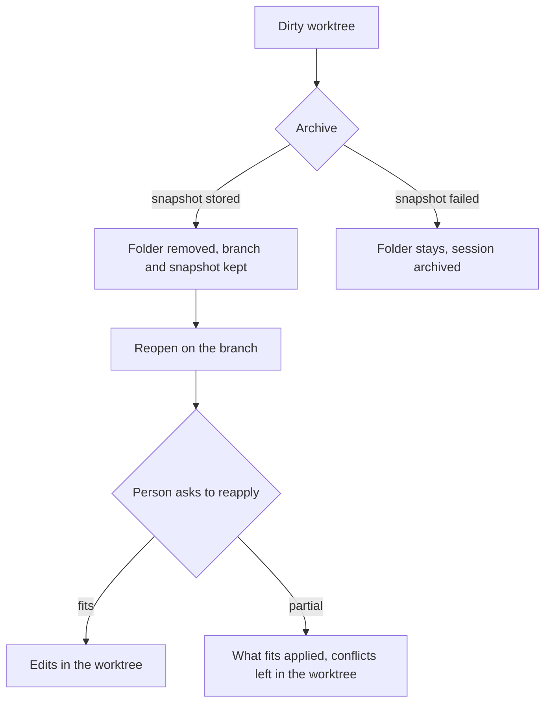

# Dirty Worktree Archive - Plan

## Goal Capsule

- **Objective:** When a person archives a session whose agent left uncommitted work, save that work as a private local snapshot, remove the worktree folder, keep the branch on this machine, and reopen onto that branch with the snapshot unapplied until the person asks.
- **Product authority:** This plan owns that archive path only. Sharing package installs across worktrees, and large tracked files checked out in every worktree, are not active scope.
- **Open blockers:** None.

---

## Product Contract

### Summary

Archiving a session that still has unfinished agent work stores that work as one private local snapshot, then removes the worktree folder and leaves the branch on this machine. Reopening checks out that branch in a new worktree. The saved edits return only when the person asks, and conflicts stay in the worktree.

### Problem Frame

An agent often stops mid-edit. It edits tracked files, adds new files, and leaves both uncommitted. Archive today still marks the session archived, and a dirty worktree stays on disk, so the folder the person meant to put away remains. The clean-tree case, where everything is already committed, is the uncommon one. Several sessions in one repo make a single shared stash stack a poor place for that leftover work: a later stash can bury or drop it.

### Key Decisions

- **Private local snapshot.** (session-settled: user-directed — chosen over a shared Git stash and over committing the unfinished work onto the branch: sessions in one repo must not share one stash stack, and the edits must not come back as commits.) Governs R1, R3.
- **Reopen shows the branch only.** (session-settled: user-directed — chosen over applying the saved edits automatically: the person decides whether to put them back.) Governs R9, R10.
- **Reapply leaves conflicts in the worktree.** (session-settled: user-directed — chosen over refusing the whole apply: what fits lands, and the person fixes the rest.) Governs R11.
- **Snapshot contents.** (session-settled: user-directed — chosen over tracked files only and over including ignored files: new files the agent created are kept, and ignored files such as installed dependencies are not.) Governs R2.
- **Folder stays when the save cannot be proven.** (session-settled: user-directed — chosen over removing the folder anyway: unfinished work is not discarded when the snapshot is not durable.) Governs R5, R6.
- **One snapshot per session.** A later archive replaces it only after the new snapshot is durable. Governs R7.
- **Capture after the agent has stopped.** The snapshot is the work left at stop, rather than a race with an agent that is still writing. Governs R8.
- **No backfill.** (session-settled: user-approved — chosen over cleaning folders already left behind: this covers archives from here on.) Governs R14.
- **Snapshot lifetime follows the session.** (session-settled: user-approved — chosen over keeping saved edits after the session record is gone: deleting the session record deletes the snapshot.) Governs R13.

### Actors

- A1. The person who archives a session, reopens it, and asks to put saved edits back.
- A2. The agent that left uncommitted work. It does not choose archive or reapply.

### Requirements

**Saving unfinished work**

- R1. Archiving a session that still has uncommitted work stores that work as one private local snapshot for that session and, per R5, removes the worktree folder.
- R2. The snapshot includes edits to tracked files and new files that are not ignored, and excludes ignored files.
- R3. The snapshot stays on this machine and is not a commit on the session branch.
- R4. The session branch stays on this machine.
- R5. The worktree folder is removed only after that session's snapshot is stored durably. If the snapshot cannot be stored, the folder stays.
- R6. When the snapshot cannot be stored, the session still archives, and the person can tell that the folder was kept because the save failed.
- R7. A session keeps at most one snapshot. A later archive replaces it only after the new snapshot is stored durably. If that later save fails, the previous snapshot and the folder both remain.
- R8. Capture runs only after that session's agent has stopped.

**Reopen and reapply**

- R9. Reopening an archived session creates a worktree checked out on the session branch. The snapshot stays unapplied.
- R10. Only an explicit request from A1 applies the snapshot. Reopening, starting the agent, and any other action do not.
- R11. That request applies what fits the current branch and leaves conflicts in the worktree. It does not create a commit.
- R12. If the session branch is missing, reopen tells A1 the branch is missing. The snapshot remains, and reopen does not build a branch from it.

**Lifetime, past sessions, and the clean case**

- R13. The snapshot is removed when the session record is removed. This plan does not add a new way to delete an archived session.
- R14. Sessions already archived with a dirty worktree left on disk are left as they are.
- R15. Archiving a session with no uncommitted work removes the worktree folder and does not create a snapshot.
- R16. After a successful archive of unfinished work, A1 can tell that the edits were saved apart from the branch and return only when they ask.

### Key Flows

- F1. Archive with unfinished work
  - **Trigger:** A1 archives a session after A2 has stopped with uncommitted work.
  - **Actors:** A1, A2
  - **Steps:** The agent is already stopped. The snapshot is stored. Per R5, the folder is removed. The branch stays. The session is archived. Per R16, A1 can tell the edits were saved apart from the branch.
  - **Covered by:** R1, R3, R4, R5, R8, R16
- F2. Reopen
  - **Trigger:** A1 reopens an archived session that has a snapshot.
  - **Actors:** A1
  - **Steps:** A new worktree is checked out on the session branch. The snapshot stays unapplied until A1 asks.
  - **Covered by:** R9, R10
- F3. Reapply
  - **Trigger:** A1 asks to put the saved edits back on the reopened worktree.
  - **Actors:** A1
  - **Steps:** What fits the current branch is applied. Conflicts remain in the worktree. No commit is created.
  - **Covered by:** R10, R11
- F4. Save failed
  - **Trigger:** A1 archives a dirty session and the snapshot cannot be stored.
  - **Actors:** A1
  - **Steps:** The folder stays. The session still archives. A1 can tell the folder was kept because the save failed.
  - **Covered by:** R5, R6

### Acceptance Examples

- AE1. Dirty archive keeps the agent's unfinished files
  - **Covers R1, R2, R3, R4, R8, R16.**
  - **Given:** The agent has stopped. The worktree has an edit to a tracked file, a new untracked file, and an ignored dependency directory.
  - **When:** A1 archives the session.
  - **Then:** The folder is gone, the branch is unchanged and still on this machine, the snapshot holds the tracked edit and the new file and not the ignored directory, and A1 can tell the edits return only when they ask.
- AE2. Failed save leaves the folder
  - **Covers R5, R6.**
  - **Given:** The snapshot cannot be stored.
  - **When:** A1 archives the dirty session.
  - **Then:** The folder remains, the session is archived, and A1 can tell the folder was kept because the save failed.
- AE3. Reopen does not restore edits
  - **Covers R9, R10.**
  - **Given:** AE1 has succeeded.
  - **When:** A1 reopens the session and does not ask to reapply.
  - **Then:** The new worktree is on the session branch and does not contain the saved edits.
- AE4. Reapply leaves a conflict in the worktree
  - **Covers R11.**
  - **Given:** The branch has moved so one saved edit still fits and another conflicts.
  - **When:** A1 asks to apply the snapshot.
  - **Then:** The fitting edit is in the worktree, the conflict is in the worktree, and no commit was created.
- AE5. Missing branch
  - **Covers R12.**
  - **Given:** The session has a snapshot and the session branch is gone.
  - **When:** A1 reopens the session.
  - **Then:** A1 is told the branch is missing, the snapshot remains, and no branch is built from the snapshot.
- AE6. A failed later archive keeps the previous snapshot
  - **Covers R7.**
  - **Given:** The session already has a durable snapshot, and the new snapshot cannot be stored.
  - **When:** A1 archives the session again.
  - **Then:** The previous snapshot remains and the folder remains.
- AE7. Clean archive
  - **Covers R15.**
  - **Given:** The worktree has no uncommitted work. Ignored files may still be present.
  - **When:** A1 archives the session.
  - **Then:** The folder is removed and no snapshot is created.
- AE8. Already-archived dirty folders stay
  - **Covers R14.**
  - **Given:** A session was archived before this change and its dirty worktree is still on disk.
  - **When:** This behavior ships.
  - **Then:** That folder is not captured or removed by this change.

### Scope Boundaries

- Sharing package installs across worktrees.
- Large tracked files checked out once per worktree.
- Capturing or removing dirty folders already left behind by earlier archives.
- A new way to delete an archived session.
- Pushing the branch or the snapshot.
- Applying the snapshot on reopen, or when the agent starts.
- Committing unfinished work onto the session branch.

### Dependencies / Assumptions

- Ignored files are disposable. A1 can recreate them after reopen, per R2.
- The written rule against force-deleting a dirty registered worktree remains the gate in R5. Removal is allowed only after the snapshot is durable.
- Local archive today keeps the session record. R13 binds snapshot removal to removal of that record and does not require a new delete action to exist.

### Outstanding Questions

- **Deferred to Planning:** Where A1 asks to reapply, as long as R10 holds.
- **Deferred to Planning:** Whether the snapshot reuses the private local capture that already runs on shutdown and on workspace replacement. Interactive archive does not run that capture today.

<!-- ce-section: work-relationships -->
### How This Work Fits Together

This plan owns archive of a worktree that still has uncommitted work. The broader disk picture below is the current understanding, not a committed roadmap. A later plan may revise, split, merge, or discard it.

- Sharing package installs across worktrees. Can proceed independently of this plan. It targets a different copy of disk, the install, which R2 does not save.
- Large tracked files checked out in every worktree. Can proceed independently of this plan. Those files are already on the branch, so removing the worktree does not change how many copies a fresh checkout creates.

### Sources / Research

- `docs/plans/session-lifecycle-persistence.md` rejects `git stash create` because it drops untracked files, and says interactive archive should not weaken the dirty-worktree refusal. R5 is that refusal, lifted only after a durable snapshot.
- `AGENTS.md` states the dirty-worktree rule that R5 qualifies.
- Shutdown teardown and workspace replacement already store a private local snapshot of tracked edits and new non-ignored files, and they leave the folder in place when that save fails. Interactive archive does not. See `backend/internal/adapters/workspace/gitworktree/workspace.go` and `backend/internal/session_manager/manager.go`.
- Git stash is one stack per repository. Jujutsu treats a dirty working copy as a commit that is not the published branch. R1 and R3 are that shape: one unpublished snapshot per session, not a branch commit and not a shared stack.
