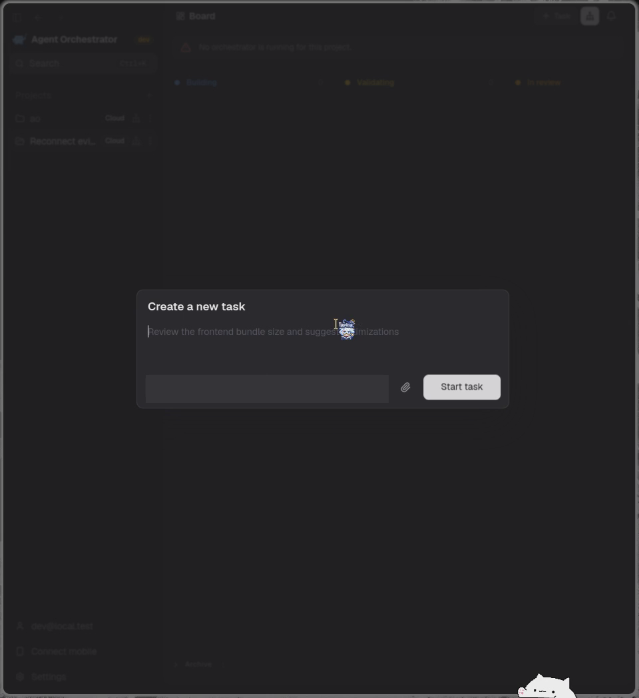

# PR #5543 visual evidence

Captured 2026-09-23 from the committed branch in the real Electron desktop app.
The app used a fresh browser profile, daemon directory, local Docker control
plane, and disposable project.

The recording shows the Cloud task composer closing and reopening within the
grace window. The reopened task field was editable. A database assertion after
reopen found one active preparation, one sandbox, the same session and sandbox
ID, and equal preparation expiries. Credential-specific selector labels are
redacted from the media.

[Close and reopen recording](reconnect-grace.mp4)
